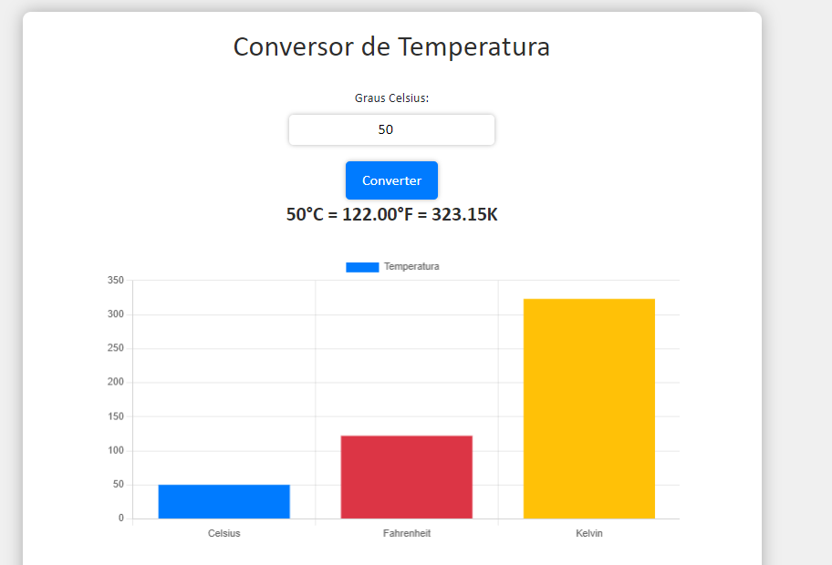
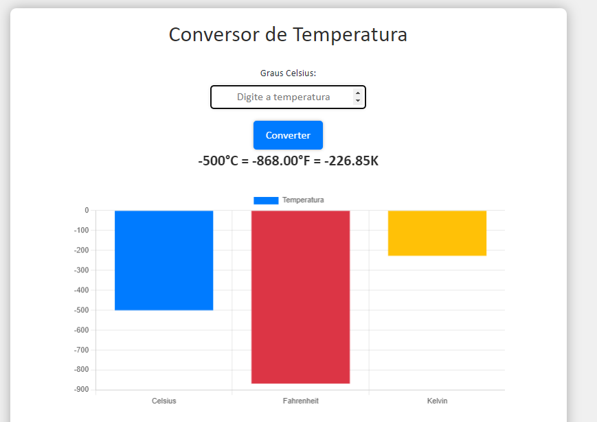

## 🧾 Descrição

Projeto de uma página web que implementa um conversor de temperatura. Possui um formulário que recebe um valor em graus Celsius e, após clicar no botão de conversão, realiza a conversão para Fahrenheit e Kelvin. O resultado é exibido na página e um gráfico de barras é gerado para exibir a porcentagem da temperatura em Celsius, Fahrenheit e Kelvin. 

Além disso, o projeto utiliza a biblioteca Chart.js para gerar o gráfico e o framework Bootstrap para estilizar a página.

<h1>

## 🔌 Tecnologias utilizadas

- **HTML:** É a linguagem de marcação utilizada para estruturar e exibir o conteúdo da página.
- **CSS:** é a linguagem utilizada para estilizar e formatar a página.
- **Bootstrap:** é uma biblioteca de componentes de interface e estilos pré-definidos para agilizar o desenvolvimento de páginas responsivas e compatíveis com diversos dispositivos.
- **Chart.js:** é uma biblioteca que permite criar gráficos dinâmicos na página.
- **jQuery:** é uma biblioteca de JavaScript que simplifica o acesso e manipulação do DOM, bem como a realização de requisições AJAX.
- **Popper.js:** é uma biblioteca que ajuda a criar popups e tooltips responsivos.

## ⚙️ Estrutura

- A estrutura técnica do código é uma página HTML com algumas folhas de estilo CSS e bibliotecas JavaScript. 
- O arquivo HTML começa com o doctype HTML5 e é escrito em linguagem HTML. 
- O arquivo também inclui as bibliotecas Chart.js e Bootstrap.
- A página HTML contém um formulário com um campo de entrada de texto para a temperatura em graus Celsius e um botão "Converter". 
- Quando o usuário envia o formulário, o JavaScript é acionado para converter a temperatura em Celsius em Fahrenheit e Kelvin e exibir o resultado na tela.
- O JavaScript também utiliza a biblioteca Chart.js para criar um gráfico de barras que exibe as proporções das temperaturas em Celsius, Fahrenheit e Kelvin. 
- As folhas de estilo CSS fornecem a aparência e o layout da página, incluindo o esquema de cores, fontes, margens e bordas.

## 🏳️ Como executar?

### **Passo 1**
Faça download do repositório.

### **Passo 2**
Abra o arquivo em um navegador e teste as funções.

 

## ✅ Resultado (Preview)

### **Exemplo: 50º Celsius**

 

### **Exemplo: -500º Celsius**

 

## 💻 Autor: Luan Ferreira

Portfólio:
- [Github](https://github.com/fluanbrito)

Contato:
- [Linkedin](https://www.linkedin.com/in/luanferreirab/)

<h1>

## 🚀 Sobre mim
Sou um grande entusiasta e apaixonado por tecnologia, empreendedorismo e inovação. Hoje, estou a cursar o curso de Sistema de Informação pelo Instituto Federal, faço uso profissionalmente de ferramentas e me aprofundo em temas como Marketing, Machine Learning AWS, Metodologias ágeis, Gestão de Projetos, Programação Web, Administração de Sistemas, Redes de computadores, entre outros.